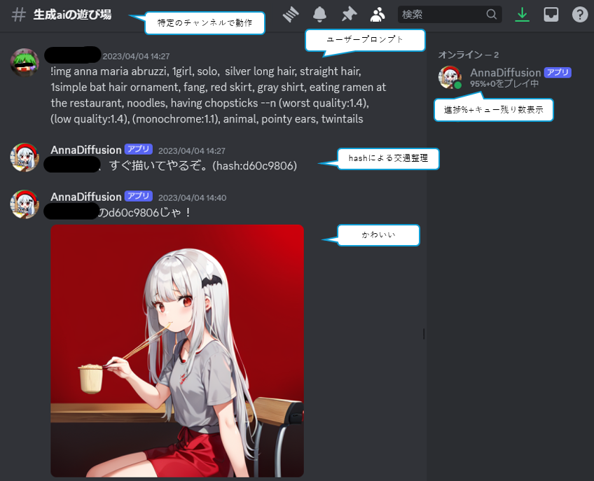

# AnnaDiffusion
ノートPCのCPUで頑張って絵を描いてくれるDiscordBot

Diffusersの取り扱いコード（gen_img_diffusers.py, model_util.py）には[kohya-ss氏のsd-scripts(Apache-2.0 license)](https://github.com/kohya-ss/sd-scripts)を使用しています。

## 特徴
* 投稿文をプロンプトとしてStableDiffusionモデルで画像を生成し、チャンネルに貼るbot
* プロンプト待受から画像生成まで、**グラボのない古いノートPCで完結**可能
  * 作者の環境：Core i5-3317U, RAM 6GBのマシンで、512x512の画像に15分
* 構築・稼働コストが低く、画像生成AIの民主化にぴったり

## Discordエンドユーザーにとっての使い方


`!img`から始まるプロンプトをチャンネルに投稿してください。画像の生成には時間がかかりますが、キューで順番に処理されるので気にせず注文しまくってよいです。

### ミニマルなプロンプト
```
!img fractal
```

画像サイズ・ステップ数はデフォルト値になります。

### 応用的なプロンプト
```
!img scenery, (portrait photo:1.2), (realistic:1.6), nikon, city, buildings, river, far town, cafe, yuri, blue sky, sun shine --n (worst quality:1.4), (low quality:1.4), (monochrome:1.1), --w 704 --h 512 --s 30
```

704x512の画像が30ステップかけて生成されます。`--n`以降のプロンプトはネガティブプロンプトです。

## bot構築のやり方
忘れました。ほぼ放置で1年以上動く実績があるということです。

* StableDiffusionモデルとvaeを配置してパスを`AnnaDiffusion.py`の中に登録
* 環境変数`DISCORD_TOKEN_ANNA`にDiscordBotトークンを入れる
* 適当なpython環境構築（`requirements.txt`を参考に、ただし全て必要とも限りません）

以上で、AnnaDiffusion.pyを走らせれば動くはずです。なお`bot.sh`はscreenの使い方をすぐ忘れる作者の補助用です。
